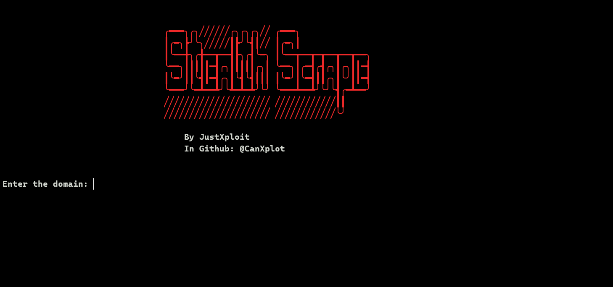
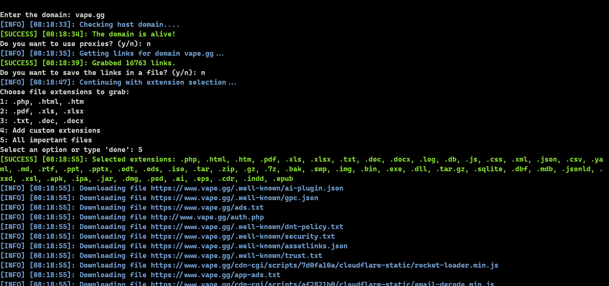

# StealthScrape

**StealthScrape** is a free and open-source tool designed to scrape and grab files of various types (e.g., PDF, XLS, XML, HTML, HTM, PHP, JS, CSS, etc.) from a specified website domain. It is lightweight, customizable, and easy to use.

## Features

- Scrapes files with different extensions like `.pdf`, `.xls`, `.xml`, `.html`, `.htm`, `.php`, `.js`, `.css`, and more.
- Simple terminal use
- Free and open-source.
- Customizable to fit your needs.

## Installation

1. Clone this repository:

   ```bash
   git clone https://github.com/CanXploit/StealthScrape.git
   ```

2. Navigate into the project directory:

   ```bash
   cd StealthScrape
   ```

3. Install the required dependencies (if any) via `pip`:

   ```bash
   pip install -r requirements.txt
   ```

## Usage

1. After installation, run the tool using the following command:

   ```bash
   python stealthscrape.py
   ```

2. The tool will prompt you to enter the following:

   - **Domain URL**: Enter the domain you want to scrape (e.g., `example.com`).
   - **Proxy File**: Enter the name of the proxy file (optional, if needed for scraping).

3. Follow the prompts to specify the file extensions you want to grab (e.g., `pdf,xls,html,js`).

4. The tool will start scraping the website and download the files into the current directory.

## Screenshot

Below is a screenshot showing how StealthScrape works from the terminal:



## License

StealthScrape is licensed under the License. See the LICENSE file for more details.
